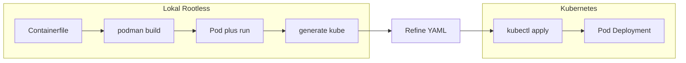

# Panduan Podman Rootless: Zero to Hero dengan fokus pada portabilitas ke Kubernetes

Panduan ini untuk **DevOps dan developer** yang ingin mengembangkan dan mengetes aplikasi di lokal dengan **Podman rootless**, lalu mendepoy ke **Kubernetes** tanpa mengubah perilaku (non-root, port, volume). Prinsip utamanya: **apa yang berjalan rootless di lokal, siap dipakai di cluster** — jika aplikasi berjalan sebagai user biasa di laptop Anda, manifest YAML yang di-generate akan selaras dengan kluster Kubernetes yang aman.

---

## Daftar isi (urutan baca)

1. [Prasyarat & instalasi Podman rootless](docs/Prasyarat.md) — Pasang Podman, verifikasi rootless, siap untuk K8s
2. [Struktur direktori proyek](docs/Direktori.md) — Pohon folder, Containerfile, deploy/k8s, Makefile
3. [Containerisasi rootless](docs/Implementasi.md) — Containerfile multi-stage, user non-root, port > 1024
4. [Pod & simulasi K8s di lokal](docs/Workflow.md#level-3-the-pod-concept-simulasi-k8s-di-lokal) — `pod create`, `pod run`, testing
5. [Generate & refinement manifest K8s](docs/Workflow.md#level-4-the-magic-generate-k8s-yaml) — `podman generate kube`, pisah Service/Deployment, security context
6. [Portabilitas: Podman vs Kubernetes](docs/Portabilitas.md) — Apa yang 1:1 terbawa, apa yang perlu disesuaikan
7. [Deploy ke Kubernetes](docs/Workflow.md#level-6-deployment-daur-ulang-ke-k8s) — `kubectl apply`, overlay Kustomize
8. [Checklist praktis per fase](ToDo.md) — Inisiasi, containerization, otomasi, validasi, generate, CI/CD, maintenance
9. [Troubleshooting](docs/Troubleshooting.md) — Masalah umum rootless, generate kube, dan K8s

---

## Alur dari lokal ke cluster



---

## Pohon direktori proyek (ringkasan)

Struktur standar yang mendukung portabilitas ke K8s:

```
podman-insider/
├── app/                 # Source code aplikasi
├── config/              # Konfigurasi non-kode
├── deploy/
│   ├── k8s/base/        # YAML dasar (hasil podman generate kube)
│   ├── k8s/overlays/    # Kustomize per environment (dev, staging)
│   └── scripts/         # Script Podman (build, local-run, gen-manifest)
├── Containerfile        # Build rootless-ready (user non-root, port > 1024)
├── Makefile             # build, run, stop, gen-k8s
└── README.md
```

Penjelasan lengkap tiap komponen: [Struktur direktori proyek](docs/Direktori.md).
